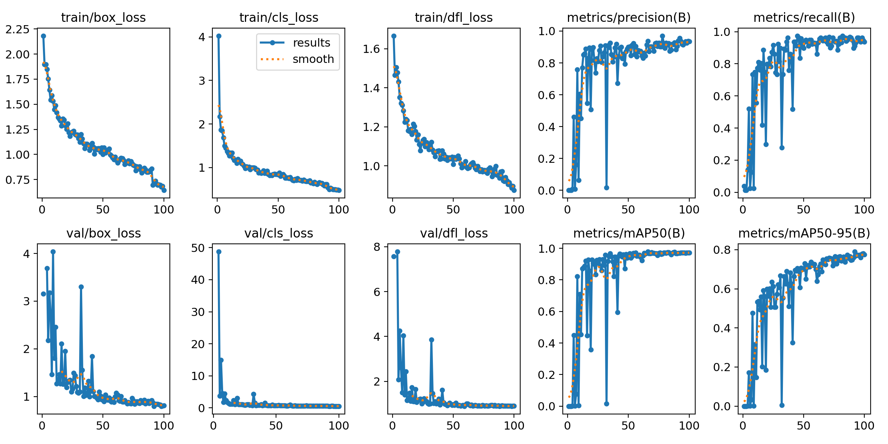
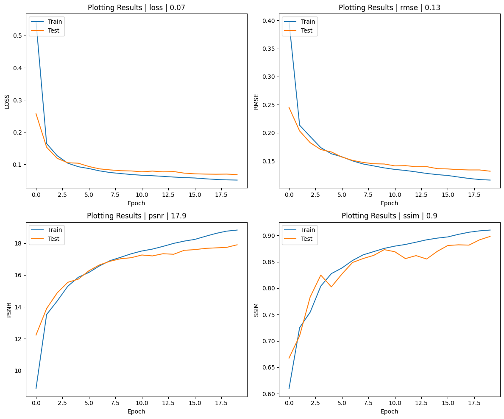
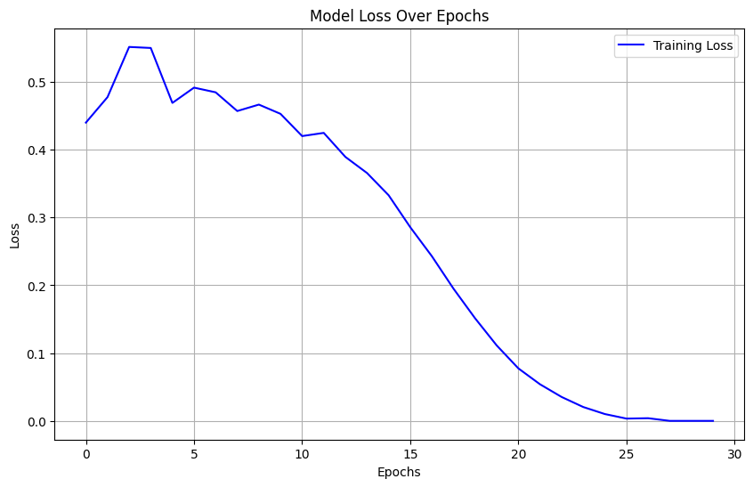
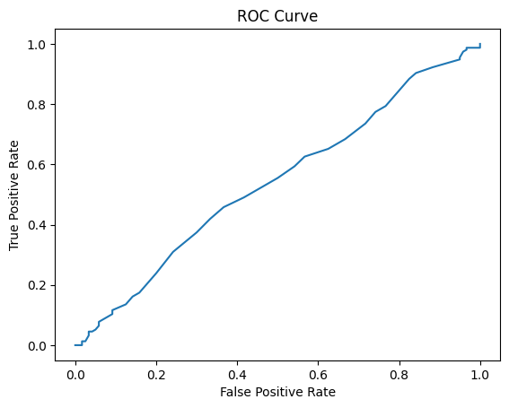

# AI Signature Classification

An AI-powered solution for detecting and classifying handwritten signatures from images. This project combines multiple stages, including object detection, denoising, and classification, to identify signatures accurately.

## Features
- **Signature Detection**: Utilizes a YOLO model to detect signatures in scanned documents.
- **Denoising**: Enhances the quality of detected signature regions using a denoising autoencoder.
- **Signature Classification**: Employs a CNN for feature extraction and Random Forest for classification.

## Project Workflow
1. **YOLO Detection**:
- Model: **YOLOv5** (custom-trained for signature detection).
- Purpose: Detects bounding boxes around signatures in scanned documents.
- Training:
  - Dataset: A custom-labeled dataset of scanned documents with annotated signature regions.
  - Framework: PyTorch with the YOLOv5 implementation.
- Output: Cropped images containing the detected signatures.

2. **Denoising**:
- Model: **Convolutional Autoencoder**.
- Purpose: Removes noise and enhances the quality of the detected signature regions.
- Architecture:
  - Encoder: Series of convolutional layers with max pooling.
  - Decoder: Transposed convolutional layers to reconstruct the cleaned signature.
- Training:
  - Dataset: Noisy and clean pairs of signature images.
  - Loss Function: Mean Squared Error (MSE).
- Output: Enhanced images of the detected signatures.

3. **Classification**:
- Models:
  - **Convolutional Neural Network (CNN)**: Used as a feature extractor.
    - Pretrained Model: VGG16 (truncated to remove the final fully connected layers).
    - Output: Feature vectors for each signature image.

  - **Random Forest (RF) Classifier**: Classifies the extracted features into signature owners.
- Training:
  - Dataset: Cropped and denoised signature images organized by owner.
  - Augmentation: Applied transformations (rotation, scaling) to generate 20 variations per signature.
- Output: Predicted class label (owner of the signature).

